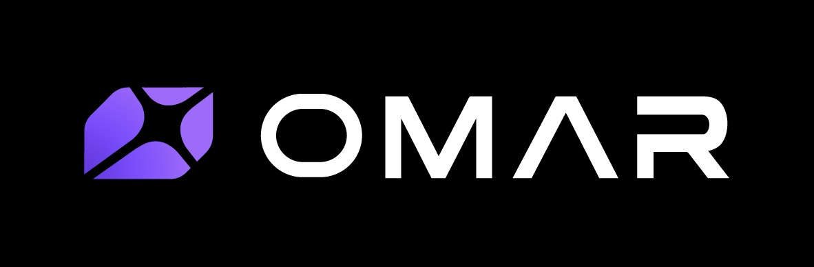

<div align="center">



**`omar` is a harness for creating powerful multi-agent workflows.**

Lead a team of 100 agents to solve humanity's biggest problems.

<p align="center">
  <a href="https://omar.rs">omar.rs</a>&nbsp; • &nbsp;
  <a href="https://omar.rs/zh/">中文</a>&nbsp; • &nbsp;
  <a href="https://opensource.org/licenses/BSD-3-Clause"></a>&nbsp; • &nbsp;
  <a href="https://github.com/lsk567/omar/actions/workflows/ci.yml"></a>&nbsp; • &nbsp;
  <a href="https://discord.gg/X76PSzmfWr"></a>
</p>

</div>


## Features

- **Deep hierarchies**: Agents managing agents, just like a company.
- **Heterogeneity**: Let `claude`, `codex`, and other agents collaborate as a team.
- **Full control**: Talk to and control any subagent you want.
- **Life span**: Long-running or ephemeral agents, your choice.
- **Customization**: Support all `tmux` commands you love.

Other features include messaging systems integration (e.g., Slack), computer use, and more.

## Installation

### Prerequisites

- tmux 3.0+
- Rust 1.70+
- GNU Make
- One or more coding agents: [Claude](https://docs.anthropic.com/en/docs/agents-and-tools/claude-code/overview), [Codex](https://developers.openai.com/codex/cli), [Cursor](https://cursor.com/cli), [Opencode](https://github.com/anomalyco/opencode), or [Google Antigravity CLI](https://antigravity.google/product/antigravity-cli).

### One-liner (recommended)

```bash
curl -fsSL https://omar.rs/install.sh | sh
```

Installs all binaries to `/usr/local/bin`.

### Homebrew

```bash
brew install omar-os/omar/omar
```

### Build from source

Requires Rust 1.70+ and GNU Make.

```bash
git clone https://github.com/omar-os/omar.git
cd omar && make install
```

## Quick Start

#### Step 1: Launch `omar`

```bash
$ omar
```

Go [here](#supported-agent-backends) to see how to launch with specific agent backends.

#### Step 2: Tell the Executive Assistant (EA) to run a test prompt.

Copy the following into the EA window:
```
Run https://github.com/omar-os/omar/blob/main/prompts/tests/project-factory.md
```

You should see agents being spawned by the EA.

Tip: Use `↑↓←→` to cycle through agents at the current level. Use `Tab` to drill into a deeper level. Use `Shift+Tab` to back out.

#### Step 3: Shutdown the project.

Go back to the EA and type in:
```
Shutdown the test project and its agents.
```

## Mission Control

The web client for authoring and observing topology programs lives in
[`web/`](web/), and is built from this same commit as the runtime it talks to.

```bash
cargo run --bin omar -- serve --address 127.0.0.1:7340   # here
cd web && OMAR_SERVE_URL=http://127.0.0.1:7340 npm run dev
```

Open `http://localhost:3000`. Without `OMAR_SERVE_URL` it runs an offline demo
topology: you can draft and inspect, but not run. See [`web/README.md`](web/README.md).

## Supported Agent Backends

| Backend | How to launch |
|---------|---------------|
| [Claude Code](https://docs.anthropic.com/en/docs/agents-and-tools/claude-code/overview) | `omar -a claude` (default) |
| [Codex CLI](https://developers.openai.com/codex/cli) | `omar -a codex` |
| [Cursor CLI](https://cursor.com/cli) | `omar -a cursor` |
| [Opencode](https://github.com/anomalyco/opencode) | `omar -a opencode` |
| [Google Antigravity CLI](https://antigravity.google/product/antigravity-cli) | `omar -a agy` |

## License

BSD 3-Clause

## Contributors

Thanks to all of our amazing contributors!

<a href="https://github.com/omar-os/omar/graphs/contributors">
  
</a>

---

OMAR is made with ❤️ in Berkeley, CA.
